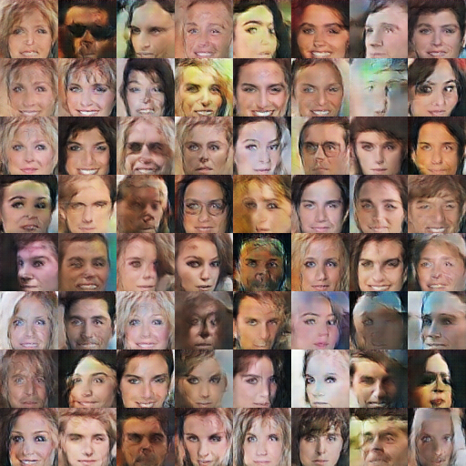

DCGAN in Tensorflow
====================

Tensorflow implementation of [Deep Convolutional Generative Adversarial Networks](http://arxiv.org/abs/1511.06434) which is a stabilize Generative Adversarial Networks. The referenced torch code can be found [here](https://github.com/soumith/dcgan.torch).

Prerequisites
-------------

- Python 2.7 or Python 3.3+
- [Tensorflow](https://www.tensorflow.org/)
- [SciPy](http://www.scipy.org/install.html)

Usage
-----

First, download dataset with:

    $ mkdir data
    $ python download.py --datasets celebA

To train a model with celebA dataset:

    $ python main.py --dataset celebA --is_train True

To test with a existing model:

    $ python main.py --dataset celebA

Or, you can use your own dataset by:

    $ mkdir data/DATASET_NAME
    ... add images to data/DATASET_NAME ...
    $ python main.py --dataset DATASET_NAME --is_train True
    $ python main.py --dataset DATASET_NAME

Results
-------

At the beginning of 1st epoch:

After 1st epoch:

(in progress)

Author
------

Taehoon Kim / [@carpedm20](http://carpedm20.github.io/)
