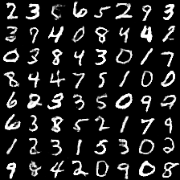

# DCGAN in Tensorflow

Tensorflow implementation of [Deep Convolutional Generative Adversarial Networks](http://arxiv.org/abs/1511.06434) which is a stabilize Generative Adversarial Networks. The referenced torch code can be found [here](https://github.com/soumith/dcgan.torch).

* [Brandon Amos](http://bamos.github.io/) wrote an excellent [blog post](http://bamos.github.io/2016/08/09/deep-completion/) and [image completion code](https://github.com/bamos/dcgan-completion.tensorflow) based on this repo.
* *To avoid the fast convergence of D (discriminator) network, G (generator) network is updated twice for each D network update, which differs from original paper.*

## Online Demo

[link](http://carpedm20.github.io/faces/)

## Prerequisites

- Python 2.7 or Python 3.3+
- [Tensorflow](https://www.tensorflow.org/)
- [SciPy](http://www.scipy.org/install.html)
- (Optional) [Align&Cropped Images.zip](http://mmlab.ie.cuhk.edu.hk/projects/CelebA.html) : Large-scale CelebFaces Dataset

## Usage

First, download dataset with:

    $ python download.py mnist
    $ python download.py celebA

To train a model with downloaded dataset:

    $ python main.py --dataset mnist --is_train True
    $ python main.py --dataset celebA --is_train True --is_crop True

To test with an existing model:

    $ python main.py --dataset mnist
    $ python main.py --dataset celebA --is_crop True

Or, you can use your own dataset (without central crop) by:

    $ mkdir data/DATASET_NAME
    ... add images to data/DATASET_NAME ...
    $ python main.py --dataset DATASET_NAME --is_train True
    $ python main.py --dataset DATASET_NAME

## Results

### celebA

After 6th epoch:

After 10th epoch:

### Asian face dataset

### MNIST

MNIST codes are written by [@PhoenixDai](https://github.com/PhoenixDai).

More results can be found [here](./assets/) and [here](./web/img/).

## Training details

Details of the loss of Discriminator and Generator (with custom dataset not celebA).

Details of the histogram of true and fake result of discriminator (with custom dataset not celebA).

## Author

Taehoon Kim / [@carpedm20](http://carpedm20.github.io/)
